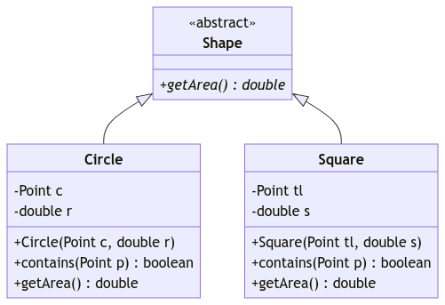

# Unit 17: Abstract Class

!!! abstract "Learning Objectives"

    Students should

    - be familiar with the concept of an abstract class.
    - know the use of the Java keyword `abstract` and the constraints that come with it.
    - understand the usefulness of defining and using an abstract class.
    - understand what makes a class concrete.

## High-Level Abstraction

Recall that the concept of abstraction involves hiding away unnecessary complexity and details so that programmers do not have to bogged down with the nitty-gritty.  That's why we abstract a real-world object into a class with only fields and methods because we only want to focus on specific behavior of the object.  For instance, we abstract a circle into a point and a radius such that we can only check if another point is contained within the circle or not via `Circle::contains` method.  While a circle may also be transformed, as long as we do not have such methods, the behavior is not captured by our abstracted circle.

When we code, we should, as much as possible, try to work with the higher-level abstraction, rather than the detailed version.  Following this principle would allow us to write code that is general and extensible, by taking full advantage of inheritance and polymorphism.

Take the following example which you have seen,

```Java title="contains v0.1"
boolean contains(Object[] array, Object obj) {
  for (Object curr : array) {
    if (curr.equals(obj)) {
      return true;
    }
  }
  return false;
}
```

The function above is very general.  We do not assume and do not need to know, about the details of the items being stored or search.  All we required is that the `equals` method compared if two objects are equal.

In contrast, someone whose mind focuses on finding a circle, might write something like this:

```Java title="contains v0.1"
boolean contains(Circle[] array, Circle circle) {
  for (Circle curr : array) {
    if (curr.equals(circle)) {
      return true;
    }
  }
  return false;
}
```

The version above serves the purpose, but is not general enough.  The only method used is `equals`, which `Circle` inherits/overrides from `Object` so that using `Circle` for this function is too constraining.  We can reuse this for any other subclasses of `Circle`, but not other classes.

## Abstracting Circles

Now, let's consider the following function, which finds the largest area among the circles in a given array:

```Java title="findLargest v0.1"
double findLargest(Circle[] array) {
  double maxArea = 0;
  for (Circle curr : array) {
	double area = curr.getArea();
    if (area > maxArea) {
	  maxArea = area;
    }
  }
  return maxArea;
}
```

`findLargest` suffers from the same specificity as the version 0.3 of `contains`.  It only works for `Circle` and its subclasses only.  Can we make this more general?  We cannot replace `Circle` with `Object`,

```Java title="findLargest v0.2"
double findLargest(Object[] array) {
  double maxArea = 0;
  for (Object curr : array) {
    double area = curr.getArea();
    if (area > maxArea) {
      maxArea = area;
    }
  }
  return maxArea;
}
```

since `getArea` is not defined for a generic object (_e.g., what does_ `getArea` _of a string mean?_).  

To allow us to apply `findLargest` to a more generic object, we have to create a new type -- something more specific than `Object` that supports `getArea()`, yet more general than `Circle`.  After all, we can have a `Square` that has an area.

## Shape

Let's create a new class called `Shape`, and redefine our `Circle` class as a subclass of `Shape`. We can now create other shapes, `Square`, `Rectangle`, `Triangle`, etc, and define the `getArea` method for each of them.

With the new `Shape` class, we can rewrite `findLargest` as:

```Java title="findLargest v0.3"
double findLargest(Shape[] array) {
  double maxArea = 0;
  for (Shape curr : array) {
    double area = curr.getArea();
    if (area > maxArea) {
      maxArea = area;
    }
  }
  return maxShape;
}
```

This version not only works for an array of `Square`, `Rectangle`, `Circle`, etc but also an array containing multiple shapes!

Let's actually write out our new `Shape` class:
```Java
class Shape {
  public double getArea() {
    // what is an area of an unknown shape?
  }
}
```

and rewrite our `Circle`:

```Java hl_lines="6 23" title="Circle v0.8"
import java.lang.Math;

/**
 * A Circle object encapsulates a circle on a 2D plane.  
 */
class Circle extends Shape {
  private Point c;   // the center
  private double r;  // the length of the radius

  /**
   * Create a circle centered on Point c with given radius r
   */
  public Circle(Point c, double r) {
    this.c = c;
    this.r = r;
  }

  /**
   * Return the area of the circle.
   */
  @Override
  public double getArea() {
    return Math.PI * this.r * this.r;
  }

  /**
   * Return true if the given point p is within the circle.
   */
  public boolean contains(Point p) {
    // TODO: Left as an exercise
    return false;
  }

  /**
   * Return the string representation of this circle.
   */
  @Override
  public String toString() {
    return "{ center: " + this.c + ", radius: " + this.r + " }";
  }

  /**
   * Return true the object is the same circle (i.e., same center, same radius).
   */
  @Override
  public boolean equals(Object obj) {
    if (obj instanceof Circle) {
      Circle circle = (Circle) obj;
      return (circle.c.equals(this.c) && circle.r == this.r);
    }
  }
}
```

Notably, since our `Shape` is a highly abstract entity, it does not have any fields.  One question that arises is, how are we going to write `Shape::getArea()`?   We cannot compute the area of a shape unless we know what sort of shape it is.  

One solution is make `Shape::getArea()` returns 0.

```Java
class Shape {
  public double getArea() {
    return 0;
  }
}
```

This is not ideal.  It is easy for someone to inherit from `Shape`, but forget to override `getArea()`.  If this happens, then the subclass will have an area of 0.  Bugs ensue.

As we usually do in CS2030S, we want to exploit programming language constructs and the compiler to check and catch such errors for us.

## Abstract Methods and Classes

This brings us to the concept of _abstract classes_.  An abstract class in Java is a class that has been made into something so general that it cannot and should not be instantiated.  Usually, this means that one or more of its instance methods cannot be implemented without further details.

!!! info "Abstract Class"
    An __abstract class__ is a class that cannot be instantiated.  If a class has at least one abstract method, it must be declared as an abstract class with the keyword `abstract` in the class declaration.
    
    Note that an _array of abstract class_ may still be created.
    
    ```java
    Shape[] shapeArr = new Shape[20];
    ```

The `Shape` class above makes a good abstract class since we do not have enough details to implement `Shape::getArea`.

To declare an abstract class in Java, we add the `abstract` keyword to the `class` declaration.  To make a method abstract, we add the keyword `abstract` when we declare the method.  

An `abstract` method cannot be implemented and therefore should not have any method body (_i.e., no_ `{ .. }`).  Instead, it ends with a semi-colon (_i.e.,_ `;`).

This is how we implement `Shape` as an abstract class.

```Java
abstract class Shape {
  public abstract double getArea();
}
```

An abstract class cannot be instantiated.  Any attempt to do so, such as:

```java
Shape s = new Shape();
```

would result in a compilation error.

```
_.java:_: error: Shape is abstract; cannot be instantiated
  	Shape s = new Shape();
  	          ^
1 error
```

Note that our simple example of `Shape` only encapsulates one abstract method.  An abstract class can contain multiple fields and multiple methods.  Not all the methods have to be abstract.  As long as one of them is abstract, the class becomes abstract.  

To illustrate this, consider
```Java
abstract class Shape {
  private int numOfAxesOfSymmetry ;

  public boolean isSymmetric() {
    return numOfAxesOfSymmetry > 0;
  }

  abstract public double getArea();
}
```

`Shape::isSymmetric` is a concrete method but the class is still abstract since `Shape::getArea()` is abstract.

!!! note "Rule for Abstract Class"
    Note that the rule for abstract class is not symmetric.
    
    > A class with __at least one__ abstract method must be declared abstract.
    
    On the other hand,
    
    > An abstract class __may have no__ abstract method.

## Concrete Classes

We call a class that is not abstract as a _concrete class_.  A concrete class cannot have any abstract method.  Thus, any subclass of `Shape` must override `getArea()` to supply its own implementation.

!!! info "Class Diagram (_Part 5_)"
    The class diagram for an abstract class is simple, we simply denote the class with `<<abstract>>` to indicate that the class is abstract.  As for abstract methods, we write the method in _italics_.
    
    Consider the classes `Shape`, `Circle`, and `Square` such that:
    
    - `Shape` is an abstract class:
        - Has a single abstract method `double getArea()`
    - `Circle` is a concrete class that is a subclass of `Shape`:
        - Has two private fields: `Point c` (_i.e., the center_) and `double r` (_i.e., the radius_)
        - Has two public concrete methods: `boolean contains(Point p)` and `double getArea()`
    - `Square` is a concrete class that is a subclass of `Shape`:
        - Has two private fields: `Point tl` (_i.e., the top-left point_) and `double s` (_i.e., the sides_)
        - Has two public concrete methods: `boolean contains(Point p)` and `double getArea()`
    
    The class diagram looks like the following:
    
    