# Lab 02: Mini Problems

!!! abstract "Learning Objectives"

    Students should
    
    - be able to extend existing OOP code to meet changing requirements.


!!! info "Initializing"

    To get the files, run the following command from your PE node.
    We recommend creating a new directory called `mini` to store all your lab mini problems.

    ```bash
    lab2@pe111:~/mini$ cp -r ~cs2030s/mini/lab2/ .
    ```

!!! warning "Lab 01 Extension"
    This problem is an extension to mini problems of Lab 01.  The solution to the mini problems of Lab 1 can be found in the accompanying directory.

    In Ex 1, you will need to copy your solution instead of having the accompanying solution.

## Mini Problem 1

!!! note "Class Diagram"
    

### Task 1: Printing

Previously, the way Alice prints the companies are not very informative to other people.  Obviously, Alice knows how to read this, but this requires a kind of convention to know the following.

- MNC: The format will be `[name]: $valuation`.
- Startup: `<name>: $valuation`
- SME: The format will be `(name): $valuation`.

For example, given the output below,

```title="Mini1.1.out"
[Goggle]: $1000
(Bong): $75
<QuackQuackGo>: $40
```

we know that `Goggle` is an MNC, `Bong` is an SME, and `QuackQuackGo` is a startup.  Unfortunately, other people may not know that.  So, Alice wants to change the way the company is being printed to make this easier to read.  The changes is summarized as follows.

| Company | Before | After |
|---|---|---|
| MNC | `[name]: $valuation` | `name [MNC]: $valuation` |
| MNC | `<name>: $valuation` | `name [SUP]: $valuation` |
| SME | `(name): $valuation` | `name [SME]: $valuation` |

Using only this changes, you should see the following sample run.

```title="Mini2.1.in"
3 5
1 Goggle 1000
3 Bong 50 5
2 QuackQuackGo 20 3
```

```title="Mini2.1.out"
Goggle [MNC]: $1000
Bong [SME]: $75
QuackQuackGo [SUP]: $40
```

### Task 2: Penny Stocks

There is a new kind of company that is representing a very risky company that is often called penny stock companies because their stocks are often priced below $1.  The valuation of this company may fluctuate before stabilizing.  The computation is as follows.

- If the valuation is even (_i.e.,_ divisible by 2), then the next valuation after one year is halved.
- If the valuation is odd (_i.e.,_ not divisible by 2), then the next valuation is three times the old valuation plus $1.

You will need to change two things.

1. Change `Mini2.java` to read data about the new company.  We will use the number `4` to indicate penny stock company.  The only information needed are the company name and valuation similar to MNC.
2. Add the company with the given way of computing valuation.  The company will be printed in the following format:

    `name [$$$] $valuation`


You can check with the following sample run.

```title="Mini2.3.in"
4 5
1 Goggle 1000
3 Bong 50 5
2 QuackQuackGo 20 3
4 AlfaVisa 3
```

```title="Mini2.3.out"
Goggle [MNC]: $1000
Bong [SME]: $75
QuackQuackGo [SUP]: $40
AlfaVisa [$$$]: $4
```

The valuation of AlfaVisa is computed as follows: 3 $\rightarrow$ 10 $\rightarrow$ 5 $\rightarrow$ 16 $\rightarrow$ 8 $\rightarrow$ 4.


## Mini Problem 2

!!! note "Class Diagram"
    
    
### Task 1: More Interns

As Bob's company is doing well, he needs to expand the company.  For now, he intends to hire more interns.  Unfortunately, other companies also need to do the same.  Bob needs to entice interns by doubling the overtime rate.

Make the necessary changes on the program to accomplish this.

```java title="Sample Run"
/open Payroll.java
/open Employee.java
/open Intern.java

Payroll payroll = new Payroll();
Employee intern = new Intern(40, 50, 160, 25);

payroll.register(intern);
payroll.getTotalSalary(); // previously 6000, now 8000
```


### Task 2: The Chiefs

With the success of Alice's payroll system, you want to promote Alice to the role of the chief.  In particular, she will become the Chief Technology Officer (CTO).  There may be other chiefs like CEO, COO, CIO, _etc_.

So what is the salary of a chief?  It is a fixed salary actually.  So why not just manager?  The difference is that chief will also receive a bonus each time `getMonthlySalary` is invoked.  However, this bonus is only applied after the salary is given.  In other words, it will be for next month.

```java title="Sample Run"
/open Payroll.java
/open Employee.java
/open Chief.java

Payroll payroll = new Payroll();
Employee chief = new Chief(100000, 5000);

payroll.register(chief);
payroll.getTotalSalary(); // 100000
payroll.getTotalSalary(); // 105000
payroll.getTotalSalary(); // 110000
```