# Lab 03: Mini Problems

!!! abstract "Learning Objectives"

    Students should
    
    - be able to create generic data structure.
    - be able to use generic data structure.


!!! info "Initializing"

    To get the files, run the following command from your PE node.
    We recommend creating a new directory called `mini` to store all your lab mini problems.

    ```bash
    lab3@pe111:~/mini$ cp -r ~cs2030s/mini/lab3/ .
    ```

    The files will only be available on Wednesday, 11 September 2024.


!!! warning "Lab 02 Extension"
    This problem is an extension to mini problems of Lab 02.  The solution to the mini problems of Lab 2 can be found in the accompanying directory.

    In Ex 2, you will need to copy your solution instead of having the accompanying solution.

## Mini Problem 1

!!! note "Class Diagram"
    

    **Note:** We add a generic interface called `Filterable<T>`.  This interface has a single abstract method `boolean isOK(T)`.  This works as a _predicate_ that we will use in our `Stack`.

### Task 1: Creating Generic Stack

Currently, we have been using array of companies (_i.e.,_ `Company[]`) to store the list of companies in our program.  Now that we have learnt about _generics_, let's try to create our own generic data structure.  For this problem, we are going to implement a generic **stack**.

A stack is a _last in, first out_ (LIFO) data structure.  In other words, the last element you put in will be the first one taken out.  Similar to how if we look at a stack of paper, the top-most paper is the first element taken out.  Additionally, we can only place a new paper on the top-most.

Update `Stack` in the file `Stack.java` to be generic.  Study the implementation to satisfy the requirement below.

- `Stack` is a generic stack with one type parameter `T`.
- `Stack` takes in only a subtype of `Filterable` as its type argument.
- `Stack` has a constructor that takes in a single integer corresponding to the maximum size of the stack.
- `Stack` supports the following methods:
    - `void push(T elem)`: Inserts the element `elem` of type `T` to the top of the stack if the element is OK to be inserted.  An element is OK to be inserted if given the top element of the stack `top`, `elem.isOK(top)` returns `true`.  If there is no top element, the method simply inserts `elem` to the stack.  The method does nothing if the stack is full.
    - `T pop()`: Removes and returns the top element of the stack.  The method returns `null` if the stack is empty.
    - `boolean isEmpty()`: Returns `true` if the stack is empty.  Otherwise, it returns `false`.
    - `boolean isFull()`: Returns `true` if the stack is full.  Otherwise, it returns `false`.
    - `String toString()`: Returns the string representation of the stack with each element enclosed in `{ .. } <-- Top`.

Study the following sample run of a `Stack` for more information on how we use the class.

```title="Sample Run"
jshell> class A implements Filterable<A> {
   ...>   private int val;
   ...>
   ...>   public A(int val) {
   ...>     this.val = val;
   ...>   }
   ...>
   ...>   @Override
   ...>   public boolean isOK(A other) {
   ...>     return this.val >= other.val;
   ...>   }
   ...>
   ...>   @Override
   ...>   public String toString() {
   ...>     return "A{" + this.val + "}";
   ...>   }
   ...> }
|  created class A

jshell> class B1 extends A {
   ...>   public B1(int val) {
   ...>     super(val);
   ...>   }
   ...>
   ...>   @Override
   ...>   public String toString() {
   ...>     return "B1{" + super.toString() + "}";
   ...>   }
   ...> }
|  created class B1

jshell> class B2 extends A {
   ...>   public B2(int val) {
   ...>     super(val);
   ...>   }
   ...>
   ...>   @Override
   ...>   public String toString() {
   ...>     return "B2{" + super.toString() + "}";
   ...>   }
   ...> }
|  created class B2

jshell> Stack<A> s = new Stack<A>(2);
s ==> { } <-- Top
jshell> s.isEmpty();
$.. ==> true
jshell> s.isFull();
$.. ==> false
jshell> s.push(new A(3));
jshell> s
s ==> { A{3} } <-- Top
jshell> s.push(new B1(2)); // not inserted
jshell> s
s ==> { A{3} } <-- Top
jshell> s.push(new B2(4)); // inserted
jshell> s
s ==> { A{3} B2{A{4}} } <-- Top
jshell> s.push(new B2(100)); // full
jshell> s
s ==> { A{3} B2{A{4}} } <-- Top
jshell> s.pop();
$.. ==> B2{A{4}}
jshell> s
s ==> { A{3} } <-- Top
jshell> s.push(new B1(100));
jshell> s
s ==> { A{3} B1{A{100}} } <-- Top
```

### Task 2: Use Generic Stack

Modify the class `Mini3.java` to remove any usage of `Company[]` and replacing it with `Stack<Company>`.  We will read the company one by one and push it into the stack.  During this process, some company may be rejected due to the way `isOK(T)` is implemented and that is OK.

More importantly, in the method `run()`, we will find that we need a temporary `Stack` to process all the companies before copying them back to the original `Stack`.  Assuming that the original `Stack` is a field named `companies` and the number of companies is in the field named `numCompanies`, the code structure will look like the following.

```java
Stack<Company> tmp = new Stack<Company>(this.numCompanies);
while (!this.companies.isEmpty()) {
  Company company = this.companies.pop();
  // process ...
  tmp.push(company);
}
// Copy back
while (!tmp.isEmpty()) {
  this.companies.push(tmp.pop());
}
```

As a good practice, you should still copy back even after printing.  Just in case we want to do more operations, we should not end with no companies.

Note that this process may further filter out more companies.  That is fine.  In the end, there may be only one company in the output.

```title="Mini3.3.in"
4 5
1 Goggle 1000
3 Bong 50 5
2 QuackQuackGo 20 3
4 AlfaVisa 3
```

```title="Mini3.3.out"
QuackQuackGo [SUP]: $40
```

### Testing

You can test your implementation of `Stack` independently by executing `TestStack.java`.

```
javac TestStack.java
java TestStack
```

If everything is correct, you should see the following.

```title="TestStack"
Stack<A> s = new Stack<A>(2)
s.toString().. ok
s.isEmpty().. ok
s.isFull().. ok
s.push(new A(3))
s.toString().. ok
s.push(new B1(2))
s.toString().. ok
s.push(new B2(4))
s.toString().. ok
s.push(new B2(100))
s.toString().. ok
s.pop().. ok
s.toString().. ok
s.push(new B1(100))
s.toString().. ok
```


## Mini Problem 2

!!! note "Class Diagram"
    

    **Note:** We add a generic interface called `SalaryMan<T>`.  This interface has a single abstract method `T higher(T other)`.  The method returns either `this` or `other` depending on the instance with the higher salary
    
### Task 1: Creating Generic Queue

Bob prefers the use of `Queue` instead of a `Stack` as it is fairer because it is a _first in, first out_ (FIFO) data structure.  In other words, the first element you put in will be the first one taken out.  Similar to how from a queue at the canteen, you enter from the back of the queue. Then, when you reached the front, you may exit the queue.

Update `Queue` in the file `Queue.java` to be generic.  Study the implementation to satisfy the requirement below.

- `Queue` is a generic queue with one type parameter `T`.
- `Queue` takes in only a subtype of `SalaryMan` as its type argument.
- `Queue` has a constructor that takes in a single integer corresponding to the maximum size of the queue.
- `Queue` supports the following methods:
    - `void enqueue(T elem)`: Inserts the element `elem` of type `T` to back of the queue.  The method does nothing if the stack is full.
    - `boolean isEmpty()`: Returns `true` if the stack is empty.  Otherwise, it returns `false`.
    - `boolean isFull()`: Returns `true` if the stack is full.  Otherwise, it returns `false`.
    - `String toString()`: Returns the string representation of the stack with each element enclosed in `{ .. } <-- Back`.

### Task 2: Extending a Queue

Now implement the method `T findBoss()` that returns the _highest_ element.  The element `elem` is the highest if for every other element `other`, `elem.higher(other)` or `other.higher(elem)` returns `elem`.

Study the following sample run of a `Queue` for more information on how we use the class.

```title="Sample Run"
jshell> class A implements SalaryMan<A> {
   ...>   private int val;
   ...>
   ...>   public A(int val) {
   ...>     this.val = val;
   ...>   }
   ...>
   ...>   @Override
   ...>   public A higher(A that) {
   ...>     if (this.val <= that.val) {
   ...>       return this;
   ...>     }
   ...>     return that;
   ...>   }
   ...>
   ...>   @Override
   ...>   public String toString() {
   ...>     return "A{" + this.val + "}";
   ...>   }
   ...> }
|  created class A

jshell> class B1 extends A {
   ...>   public B1(int val) {
   ...>     super(val);
   ...>   }
   ...>
   ...>   @Override
   ...>   public String toString() {
   ...>     return "B1{" + super.toString() + "}";
   ...>   }
   ...> }
|  created class B1

jshell> class B2 extends A {
   ...>   public B2(int val) {
   ...>     super(val);
   ...>   }
   ...>
   ...>   @Override
   ...>   public String toString() {
   ...>     return "B2{" + super.toString() + "}";
   ...>   }
   ...> }
|  created class B2

jshell> Queue<A> q = new Queue<A>(2);
q ==> { } <-- Back
jshell> q.enqueue(new B1(2));
jshell> q.enqueue(new B2(10));
jshell> q
q ==> { B1{A{2}} B2{A{10}} } <-- Back
jshell> q.findBoss();
$.. ==> B1{A{2}}
jshell> q.enqueue(new A(1)); // full
jshell> q
q ==> { B1{A{2}} B2{A{10}} } <-- Back
```

### Testing

You can test your implementation of `Queue` independently by executing `TestQueue.java`.

```
javac TestQueue.java
java TestQueue
```

If everything is correct, you should see the following.

```title="TestQueue"
Queue<A> s = new Stack<A>(2)
q.toString().. ok
q.isEmpty().. ok
q.isFull().. ok
q.enqueue(new B1(2))
q.enqueue(new B2(10))
q.toString().. ok
q.findBoss().. ok
q.enqueue(new A(1))
q.toString().. ok
```